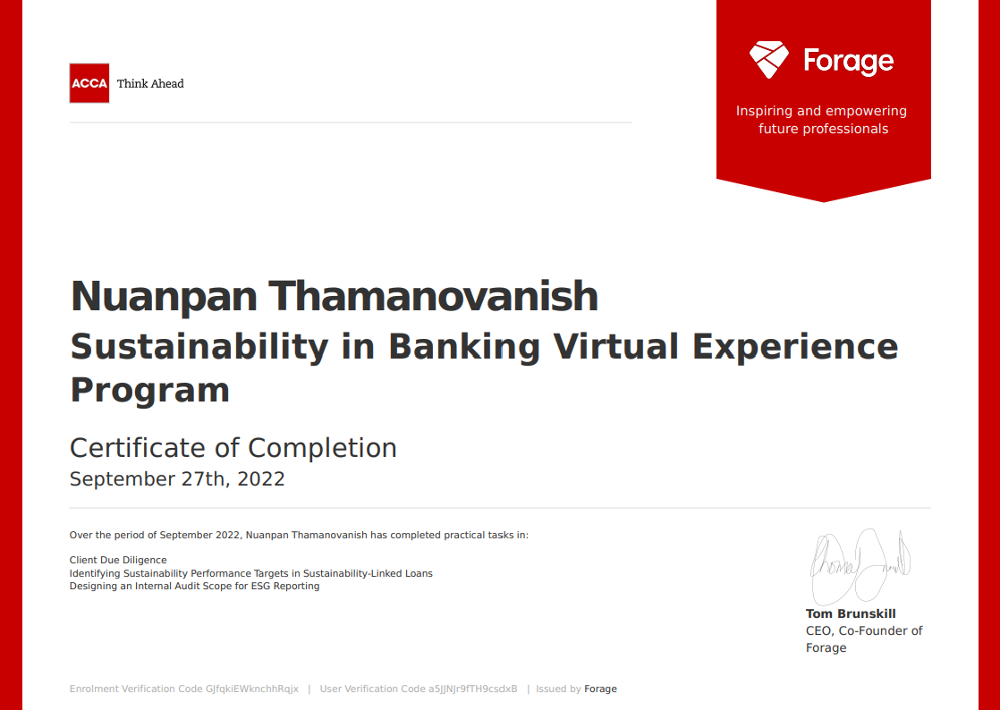

# ACCA and CIMB Group Sustainability in Banking Virtual Experience Sustainability Program. 

This project is part of ACCA and CIMB Group Sustainability in Banking Virtual Experience Sustainability Program. 

## Client Due Diligence

The First task aims to identify the controversies associated with Palm Ventures’ business operations and ESG risks within the palm oil industry. 
- Controversies evaluation
- Risk assessment 
- Gap analysis

## Sustainability Performance Targets identification in Sustainability-Linked Loans

The second task is to select the most relevant KPIs and determine the most appropriate sustainability performance targets (SPTs) for Palm Ventures in the design of a Sustainability-Linked Loan. 
- Material Issues & Potential KPIs
- Identifying KPIs based on SPTs – Materiality, Additionality, and Data Availability & External Verification
- SPT calibration & Benchmarking

